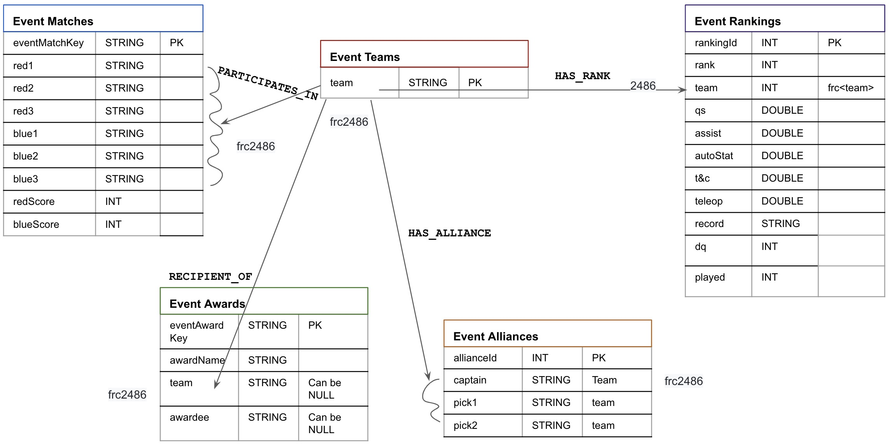

# Introduction
This file combines the schema script and loading job script.

<p align="center">
    
</p>

## Vertex Types
We create a vertex type with the entity's name in UpperCamelCase.

- **EventTeams** is a list of event teams.
- **EventMatches** are the event matches.
- **EventAlliances** are the alliances between teams.
- **EventRankings** are the rankings for each event.
- **EventAwards** are the event awards.

## Edge Types
For each relationship type,  we create an edge type with the relationship name (all capitalized and words are separated by an underscore).

- **PARTICIPATES_IN**: Team A participates in match X
- **HAS_ALLIANCE**: Team A has an alliance with Team B
- **HAS_RANK**: Team A has a rank
- **RECIPIENT_OF**: Team A is a recipient of an award

In a TigerGraph system, reverse edges provide the most efficient way to perform graph queries and searches that need to look "backwards"

## <ins> Schema in Table format </ins>

**<ins>Event Teams</ins>**
| **Attribute** | **Data Type** | **Note** |
|-|-|-|
| team | STRING | PK |

**<ins>Event Matches</ins>**
| **Attribute** | **Data Type** | **Note** |
|-|-|-|
| eventMatchKey | STRING | PK, example: `<event_key>_<match_key>` |
| red1 | STRING |
| red2 | STRING |
| red3 | STRING |
| blue1 | STRING |
| blue2 | STRING |
| blue3 | STRING |
| redScore | INT |
| blueScore | INT |

**<ins>Event Alliances</ins>**
| **Attribute** | **Data Type** | **Note** |
|-|-|-|
| allianceId | INT | PK |
| captain | STRING | teamName |
| pick1 | STRING | primary - team |
| pick2 | STRING | primary - team |

**<ins>Event Rankings</ins>**
| **Attribute** | **Data Type** | **Note** |
|-|-|-|
| rankingId | INT | PK |
| rank | INT |
| team | INT | String: fr{team}
| qs | DOUBLE |
| assist | DOUBLE |
| autoStat | DOUBLE |
| t&c | DOUBLE |
| teleop | DOUBLE |
| record | STRING |
| dq | INT |
| played | INT |

**<ins>Event Awards</ins>**
| **Attribute** | **Data Type** | **Note** |
|-|-|-|
| eventAwardKey | STRING | PK, example: `<event_key>_<award_type_enum>` |
| awardName | STRING |  |
| team | STRING | Can be NULL |
| awardee | STRING | Can be NULL |

### Notes
By convention, we have put all of our CREATE VERTEX, CREATE EDGE, and the final CREATE GRAPH statements in one file.
- In default mode, a `PRIMARY_ID` is not an attribute, but the `WITH primary_id_as_attribute="true"` clause can be used to make it an attribute.  Alternately, the `PRIMARY KEY` is always an attribute; the WITH option is unneeded.
    - `PRIMARY KEY` is not supported in GraphStudio. If you decide to use this feature, you will only be able to use command line interface.

---
## Build Schema
To execute these statements, run the command file `blue_alliance_model.gsql`.  From within the shell, you would run
```
@blue_alliance_model.gsql 
```
From outside the shell, you would run 
```
> blue_alliance_model.gsql
```
---
## References
- [Defining a Graph Schema](https://docs.tigergraph.com/dev/gsql-ref/ddl-and-loading/defining-a-graph-schema)
- [setup_schema.sql](https://raw.githubusercontent.com/tigergraph/ecosys/ldbc/ldbc_benchmark/tigergraph/gsql102/3.0/setup_schema.gsql)
- [Create a loading job](https://docs.tigergraph.com/dev/gsql-ref/ddl-and-loading/creating-a-loading-job)
